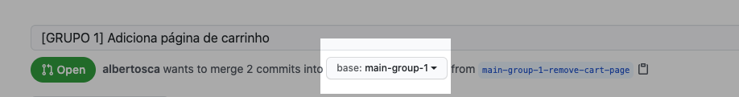
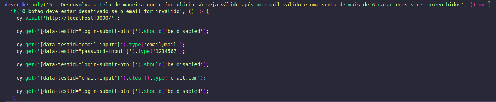
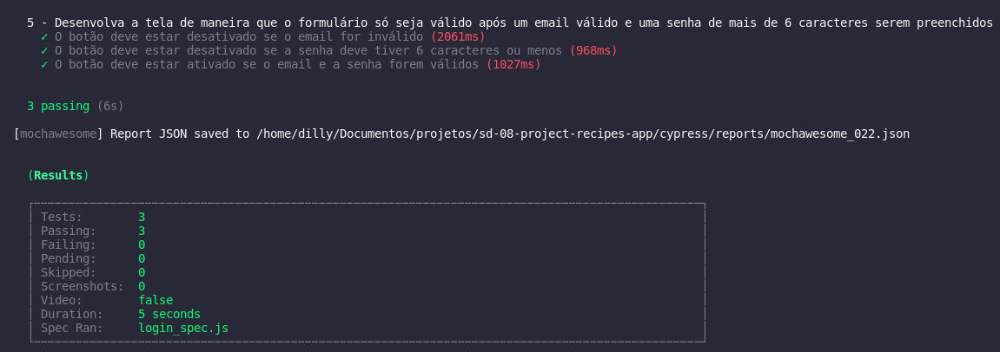

### Termos de uso

Ao iniciar este projeto, você concorda com as diretrizes do Código de Ética e Conduta e do Manual da Pessoa Estudante da Trybe.

---

# Boas vindas ao repositório do projeto de Receitas!

Você já usa o GitHub diariamente para desenvolver os exercícios, certo? Agora, para desenvolver os projetos, você deverá seguir as instruções a seguir. Fique atento a cada passo, e se tiver qualquer dúvida, nos envie por _Slack_! #vqv 🚀

Aqui você vai encontrar os detalhes de como estruturar o desenvolvimento do seu projeto a partir desse repositório, utilizando uma branch específica e um _Pull Request_ para colocar seus códigos.

---

# Sumário

- [Habilidades](#habilidades)

- [Entregáveis](#entregáveis)
  - [O que deverá ser desenvolvido](#o-que-deverá-ser-desenvolvido)
    - [Protótipo do projeto](#protótipo-do-projeto)
  - [Desenvolvimento](#desenvolvimento)
  - [Data de entrega](#data-de-entrega)

- [Instruções para entregar seu projeto](#instruções-para-entregar-seu-projeto)
  - [Antes de começar a desenvolver](#antes-de-começar-a-desenvolver)
  - [Durante o desenvolvimento](#durante-o-desenvolvimento)

- [Como desenvolver](#como-desenvolver)
  - [Linter](#linter)
  - [Execução de testes de requisito](#execução-de-testes-de-requisito)
  - [APIs](#apis)
    - [TheMealDB API](#themealdb-api)
    - [The CockTailDB API](#the-cocktaildb-api)

- [Requisitos do projeto](#requisitos-do-projeto)
  - [Observações técnicas](#observações-técnicas)
    - [Rotas](#rotas)
    - [localStorage](#localstorage)
    - [Ícones](#ícones)
    - [Biblioteca clipboard-copy](#biblioteca-clipboard-copy)
    - [Biblioteca Bootstrap (opcional)](#biblioteca-bootstrap-opcional)
  - [Lista de requisitos](#lista-de-requisitos)
  
  <details>
    <summary>Testes unitários</summary>

    - [1 - Desenvolva os testes unitários de maneira que a cobertura seja de, no mínimo, 90%](#1---desenvolva-os-testes-unitários-de-maneira-que-a-cobertura-seja-de-no-mínimo-90%)
  </details>
  
  <details>
    <summary>Tela de Login</summary>

    <!-- - [Tela de login](#tela-de-login) -->
    - [2 - Crie todos os elementos que devem respeitar os atributos descritos no protótipo para a tela de login](#2---crie-todos-os-elementos-que-devem-respeitar-os-atributos-descritos-no-protótipo-para-a-tela-de-login)
    - [3 - Desenvolva a tela de maneira que a pessoa deve conseguir escrever seu email no input de email](#3---desenvolva-a-tela-de-maneira-que-a-pessoa-deve-conseguir-escrever-seu-email-no-input-de-email)
    - [4 - Desenvolva a tela de maneira que a pessoa deve conseguir escrever sua senha no input de senha](#4---desenvolva-a-tela-de-maneira-que-a-pessoa-deve-conseguir-escrever-sua-senha-no-input-de-senha)
    - [5 - Desenvolva a tela de maneira que o formulário só seja válido após um email válido e uma senha de mais de 6 caracteres serem preenchidos](#5---desenvolva-a-tela-de-maneira-que-o-formulário-só-seja-válido-após-um-email-válido-e-uma-senha-de-mais-de-6-caracteres-serem-preenchidos)
    - [6 - Salve 2 tokens no localStorage após a submissão, identificados pelas chaves mealsToken e cocktailsToken](#6---salve-2-tokens-no-localstorage-após-a-submissão-identificados-pelas-chaves-mealstoken-e-cocktailstoken)
    - [7 - Salve o e-mail da pessoa usuária no localStorage na chave user após a submissão](#7---salve-o-e-mail-da-pessoa-usuária-no-localstorage-na-chave-user-após-a-submissão)
    - [8 - Redirecione a pessoa usuária para a tela principal de receitas de comidas após a submissão e validação com sucesso do login](#8---redirecione-a-pessoa-usuária-para-a-tela-principal-de-receitas-de-comidas-após-a-submissão-e-validação-com-sucesso-do-login)
  </details>

  <details>
    <summary>Header</summary>

    - [9 - Implemente os elementos do header na tela principal de receitas, respeitando os atributos descritos no protótipo](#9---implemente-os-elementos-do-header-na-tela-principal-de-receitas-respeitando-os-atributos-descritos-no-protótipo)
    - [10 - Implemente um ícone para a tela de perfil, um título e um ícone para a busca, caso exista no protótipo](#10---implemente-um-ícone-para-a-tela-de-perfil-um-título-e-um-ícone-para-a-busca-caso-exista-no-protótipo)
    - [11 - Redirecione a pessoa usuária para a tela de perfil ao clicar no botão de perfil](#11---redirecione-a-pessoa-usuária-para-a-tela-de-perfil-ao-clicar-no-botão-de-perfil)
    - [12 - Desenvolva o botão de busca que, ao ser clicado, a barra de busca deve aparecer. O mesmo serve para escondê-la](#12---desenvolva-o-botão-de-busca-que-ao-ser-clicado-a-barra-de-busca-deve-aparecer-o-mesmo-serve-para-escondê-la)
  </details>

  <details>
    <summary>Barra de busca</summary>

    <!-- - [Barra de busca - Header](#barra-de-busca---header) -->
    - [13 - Implemente os elementos da barra de busca respeitando os atributos descritos no protótipo](#13---implemente-os-elementos-da-barra-de-busca-respeitando-os-atributos-descritos-no-protótipo)
    - [14 - Posicione a barra logo abaixo do header e implemente 3 radio buttons: Ingrediente, Nome e Primeira letra](#14---posicione-a-barra-logo-abaixo-do-header-e-implemente-3-radio-buttons-ingrediente-nome-e-primeira-letra)
    - [15 - Busque na API de comidas caso a pessoa esteja na página de comidas e na de bebidas caso esteja na de bebidas](#15---busque-na-api-de-comidas-caso-a-pessoa-esteja-na-página-de-comidas-e-na-de-bebidas-caso-esteja-na-de-bebidas)
    - [16 - Redirecione para a tela de detalhes da receita caso apenas uma receita seja encontrada, com o ID da mesma na URL](#16---redirecione-para-a-tela-de-detalhes-da-receita-caso-apenas-uma-receita-seja-encontrada-com-o-id-da-mesma-na-url)
    - [17 - Mostre as receitas em cards caso mais de uma receita seja encontrada](#17--mostre-as-receitas-em-cards-caso-mais-de-uma-receita-seja-encontrada)
    - [18 - Exiba um `alert` caso nenhuma receita seja encontrada](#18---exiba-um-alert-caso-nenhuma-receita-seja-encontrada)
  </details>

  <details>
    <summary>Menu inferior</summary>

    - [19 - Implemente os elementos do menu inferior respeitando os atributos descritos no protótipo](#19---implemente-os-elementos-do-menu-inferior-respeitando-os-atributos-descritos-no-protótipo)
    - [20 - Posicione o menu inferior de forma fixa e apresente 3 ícones: um para comidas, um para bebidas e outro para exploração](#20---posicione-o-menu-inferior-de-forma-fixa-e-apresente-3-ícones-um-para-comidas-um-para-bebidas-e-outro-para-exploração)
    - [21 - Exiba o menu inferior apenas nas telas indicadas pelo protótipo](#21---exiba-o-menu-inferior-apenas-nas-telas-indicadas-pelo-protótipo)
    - [22 - Redirecione a pessoa usuária para uma lista de cocktails ao clicar no ícone de bebidas](#22---redirecione-a-pessoa-usuária-para-uma-lista-de-cocktails-ao-clicar-no-ícone-de-bebidas)
    - [23 - Redirecione a pessoa usuária para a tela de explorar ao clicar no ícone de exploração](#23---redirecione-a-pessoa-usuária-para-a-tela-de-explorar-ao-clicar-no-ícone-de-exploração)
    - [24 - Redirecione a pessoa usuária para uma lista de comidas ao clicar no ícone de comidas](#24---redirecione-a-pessoa-usuária-para-uma-lista-de-comidas-ao-clicar-no-ícone-de-comidas)
  </details>

  <details>
    <summary>Tela principal de receitas</summary>

    - [25 - Implemente os elementos da tela principal de receitas respeitando os atributos descritos no protótipo](#25---implemente-os-elementos-da-tela-principal-de-receitas-respeitando-os-atributos-descritos-no-protótipo)
    - [26 - Carregue as 12 primeiras receitas de comidas ou bebidas, uma em cada card](#26---carregue-as-12-primeiras-receitas-de-comidas-ou-bebidas-uma-em-cada-card)
    - [27 - Implemente os botões de categoria para serem utilizados como filtro](#27---implemente-os-botões-de-categoria-para-serem-utilizados-como-filtro)
    - [28 - Implemente o filtro das receitas através da API ao clicar no filtro de categoria](#28---implemente-o-filtro-das-receitas-através-da-api-ao-clicar-no-filtro-de-categoria)
    - [29 - Implemente o filtro como um toggle, que se for selecionado de novo, o app deve retornar as receitas sem nenhum filtro](#29---implemente-o-filtro-como-um-toggle-que-se-for-selecionado-de-novo-o-app-deve-retornar-as-receitas-sem-nenhum-filtro)
    - [30 - Implemente o filtro de categoria para que apenas um seja selecionado por vez](#30---implemente-o-filtro-de-categoria-para-que-apenas-um-seja-selecionado-por-vez)
    - [31 - Desenvolva o filtro de categorias com a opção de filtrar por todas as categorias](#31---desenvolva-o-filtro-de-categorias-com-a-opção-de-filtrar-por-todas-as-categorias)
    - [32 - Redirecione a pessoa usuária, ao clicar no card, para a tela de detalhes, que deve mudar a rota e conter o id da receita na URL](#32---redirecione-a-pessoa-usuária-ao-clicar-no-card-para-a-tela-de-detalhes-que-deve-mudar-a-rota-e-conter-o-id-da-receita-na-url)
  </details>

  <details>
    <summary>Tela de detalhes de uma receita</summary>

    - [33 - Implemente os elementos da tela de detalhes de uma receita respeitando os atributos descritos no protótipo](#33---implemente-os-elementos-da-tela-de-detalhes-de-uma-receita-respeitando-os-atributos-descritos-no-protótipo)
    - [34 - Realize uma request para a API passando o `id` da receita que deve estar disponível nos parâmetros da URL](#34---realize-uma-request-para-a-api-passando-o-id-da-receita-que-deve-estar-disponível-nos-parâmetros-da-url)
    - [35 - Desenvolva a tela de forma que contenha uma imagem da receita, o título, a categoria (ou se é ou não alcoólico), uma lista de ingredientes seguidos pelas quantidades, instruções, um vídeo do youtube "embedado" e recomendações](#35---desenvolva-a-tela-de-forma-que-contenha-uma-imagem-da-receita-o-título-a-categoria-ou-se-é-ou-não-alcoólico-uma-lista-de-ingredientes-seguidos-pelas-quantidades-instruções-um-vídeo-do-youtube-embedado-e-recomendações)
    - [36 - Implemente as recomendações, para receitas de comida, a recomendação deverá ser bebida e vice-versa](#36---implemente-as-recomendações-para-receitas-de-comida-a-recomendação-deverá-ser-bebida-e-vice-versa)
    - [37 - Implemente os cards de recomendação, onde serão 6 cards, mas mostrando apenas 2 e o scroll é horizontal, similar a um `carousel`](#37---implemente-os-cards-de-recomendação-onde-serão-6-cards-mas-mostrando-apenas-2-e-o-scroll-é-horizontal-similar-a-um-carousel)
    - [38 - Desenvolva um botão de nome "Start Recipe" que deve ficar fixo na parte de baixo da tela o tempo todo](#38---desenvolva-um-botão-de-nome-start-recipe-que-deve-ficar-fixo-na-parte-de-baixo-da-tela-o-tempo-todo)
    - [39 - Implemente a solução de forma que caso a receita já tenha sido feita, o botão "Start Recipe" deve sumir](#39---implemente-a-solução-de-forma-que-caso-a-receita-já-tenha-sido-feita-o-botão-start-recipe-deve-sumir)
    - [40 - Implemente a solução de modo que caso a receita tenha sido iniciada mas não finalizada, o texto do botão deve ser "Continue Recipe"](#40---implemente-a-solução-de-modo-que-caso-a-receita-tenha-sido-iniciada-mas-não-finalizada-o-texto-do-botão-deve-ser-continue-recipe)
    - [41 - Redirecione a pessoa usuária caso o botão "Start Recipe" seja clicado, a rota deve mudar para a tela de receita em progresso](#41---redirecione-a-pessoa-usuária-caso-o-botão-start-recipe-seja-clicado-a-rota-deve-mudar-para-a-tela-de-receita-em-progresso)
    - [42 - Implemente um botão de compartilhar e um de favoritar a receita](#42---implemente-um-botão-de-compartilhar-e-um-de-favoritar-a-receita)
    - [43 - Implemente a solução de forma que, ao clicar no botão de compartilhar, o link da receita dentro do app deve ser copiado para o clipboard e uma mensagem avisando que o link foi copiado deve aparecer](#43---implemente-a-solução-de-forma-que-ao-clicar-no-botão-de-compartilhar-o-link-da-receita-dentro-do-app-deve-ser-copiado-para-o-clipboard-e-uma-mensagem-avisando-que-o-link-foi-copiado-deve-aparecer)
    - [44 - Implemente o ícone do coração (favorito) de maneira que, deve vir preenchido caso a receita esteja favoritada e "despreenchido" caso contrário](#44---implemente-o-ícone-do-coração-favorito-de-maneira-que-deve-vir-preenchido-caso-a-receita-esteja-favoritada-e-despreenchido-caso-contrário)
    - [45 - Implemente a lógica no botão de favoritar, caso seja clicado, o ícone do coração deve mudar seu estado atual, caso esteja preenchido deve mudar para "despreenchido" e vice-versa](#45---implemente-a-lógica-no-botão-de-favoritar-caso-seja-clicado-o-ícone-do-coração-deve-mudar-seu-estado-atual-caso-esteja-preenchido-deve-mudar-para-despreenchido-e-vice-versa)
    - [46 - Salve as receitas favoritas no `localStorage` na chave `favoriteRecipes`](#46---salve-as-receitas-favoritas-no-localstorage-na-chave-favoriterecipes)
  </details>

  <details>
    <summary>Tela de receita em progresso</summary>

    - [47 - Desenvolva a tela de maneira que contenha uma imagem da receita, seu titulo, sua categoria (ou se a bebida é alcoólica ou não) uma lista de ingredientes com suas respectivas quantidades e suas instruções](#47---desenvolva-a-tela-de-maneira-que-contenha-uma-imagem-da-receita-seu-titulo-sua-categoria-ou-se-a-bebida-é-alcoólica-ou-não-uma-lista-de-ingredientes-com-suas-respectivas-quantidades-e-suas-instruções)
    - [48 - Desenvolva um checkbox para cada item da lista de ingredientes](#48---desenvolva-um-checkbox-para-cada-item-da-lista-de-ingredientes)
    - [49 - Implemente uma lógica que, ao clicar no checkbox de um ingrediente, o nome dele deve ser "riscado" da lista](#49---implemente-uma-lógica-que-ao-clicar-no-checkbox-de-um-ingrediente-o-nome-dele-deve-ser-riscado-da-lista)
    - [50 - Salve o estado do progresso, que deve ser mantido caso a pessoa atualize a página ou volte para a mesma receita](#50---salve-o-estado-do-progresso-que-deve-ser-mantido-caso-a-pessoa-atualize-a-página-ou-volte-para-a-mesma-receita)
    - [51 - Desenvolva a lógica de favoritar e compartilhar, a lógica da tela de detalhes de uma receita se aplica aqui](#51---desenvolva-a-lógica-de-favoritar-e-compartilhar-a-lógica-da-tela-de-detalhes-de-uma-receita-se-aplica-aqui)
    - [52 - Implemente a solução de maneira que o botão de finalizar receita ('Finish Recipe') só pode estar habilitado quando todos os ingredientes estiverem _"checkados"_ (marcados)](#52---implemente-a-solução-de-maneira-que-o-botão-de-finalizar-receita-finish-recipe-só-pode-estar-habilitado-quando-todos-os-ingredientes-estiverem-checkados-marcados)
    - [53 - Redirecione a pessoa usuária após clicar no botão de finalizar receita ('Finish Recipe'), para a página de receitas feitas, cuja rota deve ser `/receitas-feitas`](#53---redirecione-a-pessoa-usuária-após-clicar-no-botão-de-finalizar-receita-finish-recipe-para-a-página-de-receitas-feitas-cuja-rota-deve-ser-receitas-feitas)
  </details>

  <details>
    <summary>Tela de receitas feitas</summary>

    - [54 - Implemente os elementos da tela de receitas feitas respeitando os atributos descritos no protótipo](#54---implemente-os-elementos-da-tela-de-receitas-feitas-respeitando-os-atributos-descritos-no-protótipo)
    - [55 - Desenvolva a tela de maneira que, caso a receita do card seja uma comida, ela deve possuir: a foto da receita, o nome, a categoria, a nacionalidade, a data em que a pessoa fez a receita, as 2 primeiras tags retornadas pela API e um botão de compartilhar](#55---desenvolva-a-tela-de-maneira-que-caso-a-receita-do-card-seja-uma-comida-ela-deve-possuir-a-foto-da-receita-o-nome-a-categoria-a-nacionalidade-a-data-em-que-a-pessoa-fez-a-receita-as-2-primeiras-tags-retornadas-pela-api-e-um-botão-de-compartilhar)
    - [56 - Desenvolva a tela de maneira que, caso a receita do card seja uma bebida, ela deve possuir: a foto da receita, o nome, se é alcoólica, a data em que a pessoa fez a receita e um botão de compartilhar](#56---desenvolva-a-tela-de-maneira-que-caso-a-receita-do-card-seja-uma-bebida-ela-deve-possuir-a-foto-da-receita-o-nome-se-é-alcoólica-a-data-em-que-a-pessoa-fez-a-receita-e-um-botão-de-compartilhar)
    - [57 - Desenvolva a solução de maneira que o botão de compartilhar deve copiar a URL da tela de detalhes da receita para o clipboard](#57---desenvolva-a-solução-de-maneira-que-o-botão-de-compartilhar-deve-copiar-a-url-da-tela-de-detalhes-da-receita-para-o-clipboard)
    - [58 - Implemente 2 botões que filtram as receitas por comida ou bebida e um terceiro que remove todos os filtros](#58---implemente-2-botões-que-filtram-as-receitas-por-comida-ou-bebida-e-um-terceiro-que-remove-todos-os-filtros)
    - [59 - Redirecione para a tela de detalhes da receita caso seja clicado na foto ou no nome da receita](#59---redirecione-para-a-tela-de-detalhes-da-receita-caso-seja-clicado-na-foto-ou-no-nome-da-receita)
  </details>

  <details>
    <summary>Tela de receitas favoritas</summary>

    - [60 - Implemente os elementos da tela de receitas favoritas (cumulativo com os atributos em comum com a tela de receitas feitas) respeitando os atributos descritos no protótipo](#60---implemente-os-elementos-da-tela-de-receitas-favoritas-cumulativo-com-os-atributos-em-comum-com-a-tela-de-receitas-feitas-respeitando-os-atributos-descritos-no-protótipo)
    - [61 - Desenvolva a tela de maneira que, caso a receita do card seja uma comida, ela deve possuir: a foto da receita, o nome, a categoria, a nacionalidade, um botão de compartilhar e um de "desfavoritar"](#61---desenvolva-a-tela-de-maneira-que-caso-a-receita-do-card-seja-uma-comida-ela-deve-possuir-a-foto-da-receita-o-nome-a-categoria-a-nacionalidade-um-botão-de-compartilhar-e-um-de-desfavoritar)
    - [62 - Desenvolva a tela de maneira que, caso a receita do card seja uma bebida, ela deve possuir: a foto da receita, o nome, se é alcoólica ou não, um botão de compartilhar e um de "desfavoritar"](#62---desenvolva-a-tela-de-maneira-que-caso-a-receita-do-card-seja-uma-bebida-ela-deve-possuir-a-foto-da-receita-o-nome-se-é-alcoólica-ou-não-um-botão-de-compartilhar-e-um-de-desfavoritar)
    - [63 - Desenvolva a solução de maneira que o botão de compartilhar deve copiar a URL da tela de detalhes da receita para o clipboard](#63---desenvolva-a-solução-de-maneira-que-o-botão-de-compartilhar-deve-copiar-a-url-da-tela-de-detalhes-da-receita-para-o-clipboard)
    - [64 - Desenvolva a solução de maneira que o botão de "desfavoritar" deve remover a receita da lista de receitas favoritas do `localStorage` e da tela](#64---desenvolva-a-solução-de-maneira-que-o-botão-de-desfavoritar-deve-remover-a-receita-da-lista-de-receitas-favoritas-do-localstorage-e-da-tela)
    - [65 - Implemente 2 botões que filtram as receitas por comida ou bebida e um terceiro que remove todos os filtros](#65---implemente-2-botões-que-filtram-as-receitas-por-comida-ou-bebida-e-um-terceiro-que-remove-todos-os-filtros)
    - [66 - Redirecione a pessoa usuária ao clicar na foto ou no nome da receita, a rota deve mudar para a tela de detalhes daquela receita](#66---redirecione-a-pessoa-usuária-ao-clicar-na-foto-ou-no-nome-da-receita-a-rota-deve-mudar-para-a-tela-de-detalhes-daquela-receita)
  </details>

  <details>
    <summary>Tela de explorar</summary>

    - [67 - Implemente os elementos da tela de explorar respeitando os atributos descritos no protótipo](#67---implemente-os-elementos-da-tela-de-explorar-respeitando-os-atributos-descritos-no-protótipo)
    - [68 - Desenvolva a tela de maneira que tenha 2 botões: um para explorar comidas e o outro para explorar bebidas](#68---desenvolva-a-tela-de-maneira-que-tenha-2-botões-um-para-explorar-comidas-e-o-outro-para-explorar-bebidas)
    - [69 - Redirecione a pessoa usuária ao clicar em um dos botões, a rota deve mudar para a página de explorar comidas ou de explorar bebidas](#69---redirecione-a-pessoa-usuária-ao-clicar-em-um-dos-botões-a-rota-deve-mudar-para-a-página-de-explorar-comidas-ou-de-explorar-bebidas)
  </details>

  <details>
    <summary>Tela de explorar bebidas ou comidas</summary>

    - [70 - Implemente os elementos da tela de explorar bebidas ou comidas respeitando os atributos descritos no protótipo](#70---implemente-os-elementos-da-tela-de-explorar-bebidas-ou-comidas-respeitando-os-atributos-descritos-no-protótipo)
    - [71 - Desenvolva 3 botões: um para explorar por ingrediente, um para explorar por nacionalidade e um para pegar uma receita aleatória](#71---desenvolva-3-botões-um-para-explorar-por-ingrediente-um-para-explorar-por-nacionalidade-e-um-para-pegar-uma-receita-aleatória)
    - [72 - Redirecione a pessoa usuária ao clicar em "By Ingredient", a rota deve mudar para a tela de explorar por ingredientes](#72---redirecione-a-pessoa-usuária-ao-clicar-em-by-ingredient-a-rota-deve-mudar-para-a-tela-de-explorar-por-ingredientes)
    - [73 - Redirecione a pessoa usuária ao clicar em "By Nationality", a rota deve mudar para tela de explorar por nacionalidades](#73---redirecione-a-pessoa-usuária-ao-clicar-em-by-nationality-a-rota-deve-mudar-para-tela-de-explorar-por-nacionalidades)
    - [74 - Redirecione a pessoa usuária ao clicar em "Surprise me!", a rota deve mudar para a tela de detalhes de uma receita, que deve ser escolhida de forma aleatória através da API](#74---redirecione-a-pessoa-usuária-ao-clicar-em-surprise-me-a-rota-deve-mudar-para-a-tela-de-detalhes-de-uma-receita-que-deve-ser-escolhida-de-forma-aleatória-através-da-api)
  </details>

  <details>
    <summary>Tela de explorar ingredientes</summary>

    - [75 - Implemente os elementos da tela de explorar ingredientes respeitando os atributos descritos no protótipo](#75---implemente-os-elementos-da-tela-de-explorar-ingredientes-respeitando-os-atributos-descritos-no-protótipo)
    - [76 - Desenvolva cards para os 12 primeiros ingredientes, de forma que cada card contenha o nome do ingrediente e uma foto](#76---desenvolva-cards-para-os-12-primeiros-ingredientes-de-forma-que-cada-card-contenha-o-nome-do-ingrediente-e-uma-foto)
    - [77 -  Redireciona a pessoa usuária ao clicar no card do ingrediente, a rota deve mudar para tela principal de receitas mas mostrando apenas as receitas que contém o ingrediente escolhido](#77----redireciona-a-pessoa-usuária-ao-clicar-no-card-do-ingrediente-a-rota-deve-mudar-para-tela-principal-de-receitas-mas-mostrando-apenas-as-receitas-que-contém-o-ingrediente-escolhido)
  </details>

  <details>
    <summary>Tela de explorar por nacionalidades</summary>

  - [78 - Implemente os elementos da tela de explorar por nacionalidades respeitando os atributos descritos no protótipo](#78---implemente-os-elementos-da-tela-de-explorar-por-nacionalidades-respeitando-os-atributos-descritos-no-protótipo)
  - [79 - Desenvolva as mesmas especificações da tela de receitas principal, com a diferença de que os filtros de categoria são substituídos por um dropdown](#79---desenvolva-as-mesmas-especificações-da-tela-de-receitas-principal-com-a-diferença-de-que-os-filtros-de-categoria-são-substituídos-por-um-dropdown)
  - [80 - Implemente o dropdown de maneira que devem estar disponíveis todas as áreas retornadas da API, incluindo a opção "All", que retorna as receitas sem nenhum filtro](#80---implemente-o-dropdown-de-maneira-que-devem-estar-disponíveis-todas-as-áreas-retornadas-da-api-incluindo-a-opção-all-que-retorna-as-receitas-sem-nenhum-filtro)
  - [81 - Implemente a rota que deve ser apenas `/explore/foods/nationalities`](#81---implemente-a-rota-que-deve-ser-apenas-explore-foods-nationalities)
  </details>

  <details>
    <summary>Tela de perfil</summary>

  - [82 - Implemente os elementos da tela de perfil respeitando os atributos descritos no protótipo](#82---implemente-os-elementos-da-tela-de-perfil-respeitando-os-atributos-descritos-no-protótipo)
  - [83 - Implemente a solução de maneira que o e-mail da pessoa usuária deve estar visível](#83---implemente-a-solução-de-maneira-que-o-e-mail-da-pessoa-usuária-deve-estar-visível)
  - [84 - Implemente 3 botões: um de nome "Done Recipes", um de nome "Favorite Recipes" e um de nome "Logout"](#84---implemente-3-botões-um-de-nome-done-recipes-um-de-nome-favorite-recipes-e-um-de-nome-logout)
  - [85 - Redirecione a pessoa usuária que, ao clicar no botão de "Favorite Recipes", a rota deve mudar para a tela de receitas favoritas](#85---redirecione-a-pessoa-usuária-que-ao-clicar-no-botão-de-favorite-recipes-a-rota-deve-mudar-para-a-tela-de-receitas-favoritas)
  - [86 - Redirecione a pessoa usuária que, ao clicar no botão de "Done Recipes", a rota deve mudar para a tela de receitas feitas](#86---redirecione-a-pessoa-usuária-que-ao-clicar-no-botão-de-done-recipes-a-rota-deve-mudar-para-a-tela-de-receitas-feitas)
  - [87 - Redirecione a pessoa usuária que, ao clicar no botão de "Logout", o `localStorage` deve ser limpo e a rota deve mudar para a tela de login](#87---redirecione-a-pessoa-usuária-que-ao-clicar-no-botão-de-logout-o-localstorage-deve-ser-limpo-e-a-rota-deve-mudar-para-a-tela-de-login)
  </details>

- [Depois de terminar o desenvolvimento (opcional)](#depois-de-terminar-o-desenvolvimento-opcional)
- [Revisando um pull request](#revisando-um-pull-request)
- [Avisos finais](#avisos-finais)

---

# Habilidades

Nesse projeto, você será capaz de:

  - Utilizar _Redux_ para gerenciar estado
  - Utilizar a biblioteca _React-Redux_
  - Utilizar a Context API do _React_ para gerenciar estado
  - Utilizar o _React Hook useState_
  - Utilizar o _React Hook useContext_
  - Utilizar o _React Hook useEffect_
  - Criar Hooks customizados

---

# Entregáveis

Para entregar o seu projeto você deverá criar um Pull Request neste repositório.

Lembre-se que você pode consultar nosso conteúdo sobre Git & GitHub no Course sempre que precisar!

## O que deverá ser desenvolvido

Você irá desenvolver um app de receitas, utilizando o que há de mais moderno dentro do ecossistema React: Hooks e Context API!

Nele será possível ver, buscar, filtrar, favoritar e acompanhar o progresso de preparação de receitas e drinks!

A base de dados serão 2 APIs distintas, uma para comidas e outra para bebidas.

O layout tem como foco dispositivos móveis, então todos os protótipos vão estar desenvolvidos em telas menores.

### Protótipo do projeto

Você pode acessar um protótipo no link abaixo:

https://www.figma.com/file/cBDVGdqQxUuVlQp3ehW7wx/Recipes-App

#### ⚠️ Lembre-se de escrever testes unitários e sinta-se livre para alterar a UI, só respeite os atributos `data-testid`, eles serão usados na correção do exercício.

#### ⚠️ Para ver os comentários sobre cada componente, basta clicar no ícone de comentários no Figma (lado esquerdo superior).


## Desenvolvimento

### Data de entrega

- Projeto em grupo.

- Serão `10` dias de projeto.

- Data de entrega para avaliação final do projeto: `28/03/2022 14:00`.

---

# Instruções para entregar seu projeto

### Antes de começar a desenvolver:

1. Clone o repositório
  * `git clone git@github.com:tryber/sd-017-project-recipes-app.git`
  * Entre na pasta do repositório que você acabou de clonar:
    * `cd sd-017-project-recipes-app`
  * Vá para a branch do seu grupo, com `git checkout main-group-XX && git pull`, onde `XX` é o número do seu grupo. Exemplos: `main-group-1`, `main-group-22`.

2. Instale as dependências e inicialize o projeto
  * Instale as dependências:
    * `npm install`
  * Inicialize o projeto:
    * `npm start` (uma nova página deve abrir no seu navegador com um texto simples)

3. Faça alterações separadas por novas branchs criadas a partir da branch `main-group-XX`, criando uma nova branch para cada demanda
  * Verifique que você está na branch `main-group-XX`
    * Exemplo: `git branch`
  * Se não estiver, mude para a branch `main-group-XX`
    * Exemplo: `git checkout main-group-XX && git pull`
  * Agora, crie uma branch para a demanda que você vai desenvolver do seu projeto
    * Você deve criar uma branch com uma breve descrição da demanda a ser desenvolvida
    * Exemplo: `git checkout -b main-group-XX-cria-campo-de-input`

4. Adicione as mudanças ao _stage_ do Git e faça um `commit`
  * Verifique que as mudanças ainda não estão no _stage_
    * Exemplo: `git status` (devem aparecer listadas as novas alterações em vermelho)
  * Adicione o arquivo alterado ao _stage_ do Git
      * Exemplo:
        * `git add .` (adicionando todas as mudanças - _que estavam em vermelho_ - ao stage do Git)
        * `git status` (devem aparecer listadas as novas alterações em verde)
  * Faça seus `commit`
      * Exemplo:
        * `git commit -m 'cria componente de input`
        * `git status` (deve aparecer uma mensagem tipo _nothing to commit_ )

5. Adicione a sua branch com o novo `commit` ao repositório remoto
  * Usando o exemplo anterior: `git push -u origin main-group-XX-cria-campo-de-input`

6. Crie um novo `Pull Request` _(PR)_
  * Vá até a página de _Pull Requests_ do [repositório no GitHub](https://github.com/tryber/sd-017-project-recipes-app/pulls)
  * Clique no botão verde _"New pull request"_
  * Clique na caixa de seleção _"Compare"_ e escolha a branch do grupo, `main-group-XX`, e a sua branch **com atenção**
  * Coloque um título para a sua _Pull Request_
    * Exemplo: _"[GRUPO XX] Cria tela de busca"_
  * Clique no botão verde _"Create pull request"_
  * Adicione uma descrição para o _Pull Request_ e clique no botão verde _"Create pull request"_
  * **Não se preocupe em preencher mais nada por enquanto!**
  * Volte até a [página de _Pull Requests_ do repositório](https://github.com/tryber/sd-017-project-recipes-app/pulls) e confira que o seu _Pull Request_ está criado

7. Assim que aprovado por pelo menos duas pessoas do seu grupo e o _Linter_ estiver adereçado, acesse **SEU** _Pull Request_ e clique no botão _"Merge pull request"_

### Durante o desenvolvimento

* ⚠ **LEMBRE-SE DE CRIAR TODOS OS ARQUIVOS DENTRO DA PASTA COM O SEU NOME** ⚠


* Faça `commits` das alterações que você fizer no código regularmente

* Lembre-se de sempre após um (ou alguns) `commits` atualizar o repositório remoto

* Os comandos que você utilizará com mais frequência são:

1. `git status` _(para verificar o que está em vermelho - fora do stage - e o que está em verde - no stage)_

2. `git add` _(para adicionar arquivos ao stage do Git)_

3. `git commit` _(para criar um commit com os arquivos que estão no stage do Git)_

4. `git push -u nome-da-branch` _(para enviar o commit para o repositório remoto na primeira vez que fizer o `push` de uma nova branch)_

5. `git push` _(para enviar o commit para o repositório remoto após o passo anterior)_

---

# Como desenvolver

Este repositório **já conta com uma `main-group` para cada grupo**, identificada como `main-group-1` para o grupo 1, `main-group-2` para o grupo 2, e assim por diante. Para desenvolver, você sempre deve:

* **Criar sua branch de desenvolvimento a partir da sua branch main**. Para isso, clone este repositório, faça o `git checkout main-group-XX && git pull` e em seguida o `git checkout -b main-group-XX-minha-feature`.
* Para criar uma Pull Request para fazer **Code Review**, entitule-a `[GRUPO XX] Meu título` e **sempre aponte a Pull Request da sua branch para a branch `main-group-XX` do seu grupo, como no exemplo abaixo:**



* Quando várias pessoas desenvolvem para um mesmo projeto podem ocorrer **conflitos de merge** que precisarão ser resolvidos. Prestem atenção a isso!

⚠ **ATENÇÃO! É POSSÍVEL COMMITAR, POR ENGANO, NA BRANCH DE OUTRO GRUPO, ENTÃO TOME MUITO CUIDADO** ⚠

Você verá que os requisitos do projeto possuem, além das observações técnicas e do que será validado, descrições tais quais se veriam em um projeto real. É muito importante ser capaz de ler descrições como essa e transformá-las em produtos ou, se houver dúvida, saber tirá-las! Seguimos à disposição no Slack para isso.


Este repositório já contem um _template_ com um App React criado, configurado e com os testes automatizados que fazem parte da correção. Ele também conta com uma branch **main-group** para cada grupo, identificada como `main-group-1` para o grupo 1, `main-group-2` para o grupo 2 e assim por diante.

### Linter

Para garantir a qualidade do seu código de forma a tê-lo mais legível, de mais fácil manutenção e seguindo as boas práticas de desenvolvimento nós utilizamos neste projeto o linter `ESLint`. Para rodar o linter localmente no seu projeto, execute o comando abaixo:

```bash
npm run lint
```

⚠ **PULL REQUESTS COM ISSUES DE LINTER NÃO SERÃO AVALIADAS. ATENTE-SE PARA RESOLVÊ-LAS ANTES DE FINALIZAR O DESENVOLVIMENTO!** ⚠

### Execução de testes de requisito

Para o projeto ser validado, todos os testes de comportamento devem passar. É possível testar isso local rodando `npm run cy`. Esse comando roda a suite de testes do Cypress que valida se o fluxo geral e os requisitos funcionais estão funcionando como deveriam. Você pode também executar o comando `npm run cy:open` para ter um resultado visual dos testes executados.

Esses testes não consideram o layout de maneira geral, mas sim os atributos e informações corretas, então preste atenção nisso! Os testes te darão uma mensagem de erro caso não estejam passando (seja qual for o motivo). 😉

**Atenção:** Sua aplicação deve estar rodando para o Cypress no terminal poder testar.

#### Além dos testes da avaliação automatizada, um dos requisitos do projeto se baseia em **escrever testes unitários que cubram pelo menos 90% do projeto**. Na [documentação do Jest CLI](https://jestjs.io/docs/en/cli) é possível ver como essa cobertura é coletada.

### Dica: desativando testes

Para rodar somente um arquivo de teste, você precisa utilizar o comando:

`npm run cy -- --spec cypress/integration/login_spec.js`

**obs**: após o "spec" é preciso acrescentar todo o caminho até o arquivo de testes.

Para rodar apenas um teste, basta utilizar a função `.only` após o `describe`. Com isso, será possível que apenas um requisito rode localmente e seja avaliado.




---

### Usando o Trello como ferramenta kanban

Uma forma para seu grupo organizar as atividades e dividir as tarefas é através de um modelo de kanban. A Trybe disponibiliza um [board pré-configurado para vocês](https://trello.com/b/WHmyvnt7/app-de-receitas) duplicarem no [Trello](https://trello.com/).

Para duplicar, basta seguir os passos:

- Acesse o [link do board](https://trello.com/b/WHmyvnt7/app-de-receitas)
- Abra o menu no canto superior direito
- Selecione "copiar quadros"
- Defina o time do seu grupo e um título para o board
- Clique em `criar`
- Personalize seu novo kanban!

---

## APIs

### TheMealDB API

O [TheMealDB](https://www.themealdb.com/) é um banco de dados aberto, mantido pela comunidade, com receitas e ingredientes de todo o mundo.

Os end-points são bastante ricos, você pode [vê-los aqui](https://www.themealdb.com/api.php)

O modelo de resposta para uma `meal` é o seguinte:
  <details>
    <summary>Ver modelo de resposta para uma meal</summary>

  ```json
    {
      "meals":[
          {
            "idMeal":"52882",
            "strMeal":"Three Fish Pie",
            "strDrinkAlternate":null,
            "strCategory":"Seafood",
            "strArea":"British",
            "strInstructions":"Preheat the oven to 200C\/400F\/Gas 6 (180C fan).\r\nPut the potatoes into a saucepan of cold salted water. Bring up to the boil and simmer until completely tender. Drain well and then mash with the butter and milk. Add pepper and taste to check the seasoning. Add salt and more pepper if necessary.\r\nFor the fish filling, melt the butter in a saucepan, add the leeks and stir over the heat. Cover with a lid and simmer gently for 10 minutes, or until soft. Measure the flour into a small bowl. Add the wine and whisk together until smooth.\r\nAdd the milk to the leeks, bring to the boil and then add the wine mixture. Stir briskly until thickened. Season and add the parsley and fish. Stir over the heat for two minutes, then spoon into an ovenproof casserole. Scatter over the eggs. Allow to cool until firm.\r\nSpoon the mashed potatoes over the fish mixture and mark with a fork. Sprinkle with cheese.\r\nBake for 30-40 minutes, or until lightly golden-brown on top and bubbling around the edges.",
            "strMealThumb":"https:\/\/www.themealdb.com\/images\/media\/meals\/spswqs1511558697.jpg",
            "strTags":"Fish,Seafood,Dairy,Pie",
            "strYoutube":"https:\/\/www.youtube.com\/watch?v=Ds1Jb8H5Sg8",
            "strIngredient1":"Potatoes",
            "strIngredient2":"Butter",
            "strIngredient3":"Milk",
            "strIngredient4":"Gruy\u00e8re",
            "strIngredient5":"Butter",
            "strIngredient6":"Leek",
            "strIngredient7":"Plain Flour",
            "strIngredient8":"White Wine",
            "strIngredient9":"Milk",
            "strIngredient10":"Parsley",
            "strIngredient11":"Salmon",
            "strIngredient12":"Haddock",
            "strIngredient13":"Smoked Haddock",
            "strIngredient14":"Eggs",
            "strIngredient15":"",
            "strIngredient16":"",
            "strIngredient17":"",
            "strIngredient18":"",
            "strIngredient19":"",
            "strIngredient20":"",
            "strMeasure1":"1kg",
            "strMeasure2":"Knob",
            "strMeasure3":"Dash",
            "strMeasure4":"50g",
            "strMeasure5":"75g",
            "strMeasure6":"2 sliced",
            "strMeasure7":"75g",
            "strMeasure8":"150ml",
            "strMeasure9":"568ml",
            "strMeasure10":"2 tbs chopped",
            "strMeasure11":"250g",
            "strMeasure12":"250g",
            "strMeasure13":"250g",
            "strMeasure14":"6",
            "strMeasure15":"",
            "strMeasure16":"",
            "strMeasure17":"",
            "strMeasure18":"",
            "strMeasure19":"",
            "strMeasure20":"",
            "strSource":"https:\/\/www.bbc.co.uk\/food\/recipes\/three_fish_pie_58875",
            "dateModified":null
          }
      ]
    }
  ```
  </details>

---

Os ingredientes seguem uma ordem lógica onde o nome dele (`strIngredient1`) e a quantidade (`strMeasure1`) tem o mesmo número no final (1, nesse caso).

É possível listar todas as `categorias`, `nacionalidades` (vindas da API como "areas") e `ingredientes`:

```
categorias: https://www.themealdb.com/api/json/v1/1/list.php?c=list
nacionalidades: https://www.themealdb.com/api/json/v1/1/list.php?a=list
ingredientes: https://www.themealdb.com/api/json/v1/1/list.php?i=list
```

As fotos dos ingredientes vêm de um end-point padronizado com a seguinte lógica:

```
https://www.themealdb.com/images/ingredients/{nome-do-ingrediente}.png
// exemplo com "Lime"
https://www.themealdb.com/images/ingredients/Lime.png
```

### The CockTailDB API

Bem similar (inclusive mantida pela mesma entidade) a TheMealDB API, só que focado em bebidas.

Os end-points também são bastante ricos, você pode [vê-los aqui](https://www.thecocktaildb.com/api.php)

As respostas seguem a mesma estrutura, com algumas particularidades relativas às bebidas (como ser ou não alcoólica, por exemplo)

  <details>
    <summary>Ver modelo de resposta para drinks</summary>

  ```json
    {
      "drinks":[
          {
            "idDrink":"17256",
            "strDrink":"Martinez 2",
            "strDrinkAlternate":null,
            "strDrinkES":null,
            "strDrinkDE":null,
            "strDrinkFR":null,
            "strDrinkZH-HANS":null,
            "strDrinkZH-HANT":null,
            "strTags":null,
            "strVideo":null,
            "strCategory":"Cocktail",
            "strIBA":null,
            "strAlcoholic":"Alcoholic",
            "strGlass":"Cocktail glass",
            "strInstructions":"Add all ingredients to a mixing glass and fill with ice.\r\n\r\nStir until chilled, and strain into a chilled coupe glass.",
            "strInstructionsES":null,
            "strInstructionsDE":"Alle Zutaten in ein Mischglas geben und mit Eis f\u00fcllen. Bis zum Abk\u00fchlen umr\u00fchren und in ein gek\u00fchltes Coup\u00e9glas abseihen.",
            "strInstructionsFR":null,
            "strInstructionsZH-HANS":null,
            "strInstructionsZH-HANT":null,
            "strDrinkThumb":"https:\/\/www.thecocktaildb.com\/images\/media\/drink\/fs6kiq1513708455.jpg",
            "strIngredient1":"Gin",
            "strIngredient2":"Sweet Vermouth",
            "strIngredient3":"Maraschino Liqueur",
            "strIngredient4":"Angostura Bitters",
            "strIngredient5":null,
            "strIngredient6":null,
            "strIngredient7":null,
            "strIngredient8":null,
            "strIngredient9":null,
            "strIngredient10":null,
            "strIngredient11":null,
            "strIngredient12":null,
            "strIngredient13":null,
            "strIngredient14":null,
            "strIngredient15":null,
            "strMeasure1":"1 1\/2 oz",
            "strMeasure2":"1 1\/2 oz",
            "strMeasure3":"1 tsp",
            "strMeasure4":"2 dashes",
            "strMeasure5":null,
            "strMeasure6":null,
            "strMeasure7":null,
            "strMeasure8":null,
            "strMeasure9":null,
            "strMeasure10":null,
            "strMeasure11":null,
            "strMeasure12":null,
            "strMeasure13":null,
            "strMeasure14":null,
            "strMeasure15":null,
            "strCreativeCommonsConfirmed":"No",
            "dateModified":"2017-12-19 18:34:15"
          }
      ]
    }
  ```
  </details>

---

Os ingredientes seguem uma ordem lógica onde o nome dele (`strIngredient1`) e a quantidade (`strMeasure1`) tem o mesmo número no final (1, nesse caso).

---

# Requisitos do projeto

Os requisitos são organizados por telas e dessa vez, vocês que irão definir as prioridades! Usem com sabedoria!

Recomendamos que os requisitos de uma mesma tela sejam feitos em sequência ou paralelamente por pessoas se comunicando bastante, para não haver conflitos. Embora requisitos de uma mesma tela com prioridades iguais possam ser feitos em paralelo, mas isso exigirá organização por parte das pessoas que estão dividindo a tarefa para não ter conflitos.

* Os requisitos do seu projeto são avaliados automaticamente, sendo utilizada a resolução de tela de `360 x 640` (360 pixels de largura por 640 pixels de altura).

    - ⚠️ Logo, recomenda-se desenvolver seu projeto usando a mesma resolução, via instalação [deste plugin](https://chrome.google.com/webstore/detail/window-resizer/kkelicaakdanhinjdeammmilcgefonfh?hl=en) do `Chrome` para facilitar a configuração da resolução. ⚠️


## Observações técnicas

Algumas coisas devem seguir um padrão pré-estabelecido para que os testes de correção funcionem corretamente.

⚠️ Leia-os atentamente e siga à risca o que for pedido. O não cumprimento de um requisito, total ou parcialmente, impactará em sua avaliação. ⚠️

### Rotas

As rotas a serem utilizadas na aplicação devem ser as seguintes:

* Tela de login: `/`;
* Tela principal de receitas de comidas: `/foods`;
* Tela principal de receitas de bebidas: `/drinks`;
* Tela de detalhes de uma receita de comida: `/foods/{id-da-receita}`;
* Tela de detalhes de uma receita de bebida: `/drinks/{id-da-receita}`;
* Tela de receita em progresso de comida: `/foods/{id-da-receita}/in-progress`;
* Tela de receita em progresso de bebida: `/drinks/{id-da-receita}/in-progress`;
* Tela de explorar: `/explore`;
* Tela de explorar comidas: `/explore/foods`;
* Tela de explorar bebidas: `/explore/drinks`;
* Tela de explorar comidas por ingrediente: `/explore/foods/ingredients`;
* Tela de explorar bebidas por ingrediente: `/explore/drinks/ingredients`;
* Tela de explorar comidas por nacionalidade: `/explore/foods/nationalities`;
* Tela de perfil: `/profile`;
* Tela de receitas feitas: `/done-recipes`;
* Tela de receitas favoritas: `/favorite-recipes`.

### localStorage

O uso de `localStorage` é necessário para que as informações não se percam caso a pessoa atualize a página.
O correto é usar os valores para iniciar sua store ou seu context.

No `localStorage` do navegador:

* a chave `mealsToken` deve conter a seguinte estrutura:
```
1
```

* a chave `cocktailsToken` deve conter a seguinte estrutura:
```
1
```

* a chave `user` deve conter a seguinte estrutura:
```
{
    email: email-da-pessoa
}
```

* a chave `doneRecipes` deve conter a seguinte estrutura:
```
[{
    id: id-da-receita,
    type: comida-ou-bebida,
    nationality: nacionalidade-da-receita-ou-texto-vazio,
    category: categoria-da-receita-ou-texto-vazio,
    alcoholicOrNot: alcoholic-ou-non-alcoholic-ou-texto-vazio,
    name: nome-da-receita,
    image: imagem-da-receita,
    doneDate: quando-a-receita-foi-concluida,
    tags: array-de-tags-da-receita-ou-array-vazio
}]
```

* a chave `favoriteRecipes` deve conter a seguinte estrutura:
```
[{
    id: id-da-receita,
    type: food-ou-drink,
    nationality: nacionalidade-da-receita-ou-texto-vazio,
    category: categoria-da-receita-ou-texto-vazio,
    alcoholicOrNot: alcoholic-ou-non-alcoholic-ou-texto-vazio,
    name: nome-da-receita,
    image: imagem-da-receita
}]
```

* a chave `inProgressRecipes` deve conter a seguinte estrutura:
```
{
    cocktails: {
        id-da-bebida: [lista-de-ingredientes-utilizados],
        ...
    },
    meals: {
        id-da-comida: [lista-de-ingredientes-utilizados],
        ...
    }
}
```

**Observações técnicas**

* `id-da-bebida` e `id-da-comida` representam o ID de uma bebida e comida, respectivamente, e cada item da lista de ingredientes da respectiva receita deve ser representado apenas pelo número do ingrediente no formato numérico.

### Ícones

Os ícones a serem utilizados na aplicação estão disponíveis do diretório `src/image/`. Esses ícones serão utilizados pelos testes da avaliação automatizada, então certifique-se de utilizá-los nos requisitos e de não renomeá-los.

Os ícones são:

* `profileIcon.svg`;
* `searchIcon.svg`;
* `drinkIcon.svg`;
* `exploreIcon.svg`;
* `mealIcon.svg`;
* `shareIcon.svg`;
* `whiteHeartIcon.svg`;
* `blackHeartIcon.svg`;

### Biblioteca `clipboard-copy`

Para os componentes que contêm a funcionalidade de favoritar pratos ou bebidas, será necessário utilizar a biblioteca `clipboard-copy` para copiar as informações da receita. Essa biblioteca já vem instalada no projeto.

Para mais informações, consulte a [documentação](https://www.npmjs.com/package/clipboard-copy)

### Biblioteca `Bootstrap` (opcional)

Para os grupos que quiserem implementar estilizações no app, recomendamos o uso da lib `Bootstrap`. Ela já vem instalada por padrão neste projeto, bastando apenas implementar nos seus componentes. Por exemplo, caso queira implementar um [botão](https://react-bootstrap.github.io/components/buttons/):

``` jsx
import Button from 'react-bootstrap/Button';

const MeuComponente = () => (
  <Button variant="success">
    Botão Verde
  </Button>
);
...
```

Para mais informações, consulte a [documentação](https://react-bootstrap.github.io/getting-started/introduction/)

---

## Lista de requisitos

Nesse projeto, a pessoa que estiver utilizando o app pode procurar uma receita especifica, explorar receitas baseado em diferentes critérios, favoritar e fazer as receitas entre outras funcionalidades.

As telas sofrem variações dependendo do tipo da receita (se é comida ou bebida, no caso).

## Testes unitários

### 1 - Desenvolva os testes unitários de maneira que a cobertura seja de, no mínimo, 90%

  O que será verificado:
  ```
  - Verifica a cobertura de testes unitários
  ```

## Tela de login

### 2 - Crie todos os elementos que devem respeitar os atributos descritos no protótipo para a tela de login

  **Observações técnicas**

  * O input de email deve possuir o atributo `data-testid="email-input"`;
  * O input de senha deve possuir o atributo `data-testid="password-input"`;
  * O botão "Enter" deve possuir o atributo `data-testid="login-submit-btn"`.

  O que será verificado:
  ```
  - Tem os data-testids email-input, password-input e login-submit-btn
  ```

### 3 - Desenvolva a tela de maneira que a pessoa deve conseguir escrever seu email no input de email

  O que será verificado:
  ```
  - É possível escrever o email
  ```

### 4 - Desenvolva a tela de maneira que a pessoa deve conseguir escrever sua senha no input de senha

  O que será verificado:
  ```
  - É possível escrever a senha
  ```

### 5 - Desenvolva a tela de maneira que o formulário só seja válido após um email válido e uma senha de mais de 6 caracteres serem preenchidos

O formulário só fica válido após um email válido e uma senha de mais de 6 caracteres serem preenchidos. Caso o formulário esteja inválido, o botão de submeter deve estar desativado, contendo a propriedade `disabled`. Caso contrário, deve estar ativado, não contendo a propriedade `disabled`.

  O que será verificado:
  ```
  - O botão deve estar desativado se o email for inválido
  - O botão deve estar desativado se a senha deve tiver 6 caracteres ou menos
  - O botão deve estar ativado se o email e a senha forem válidos
  ```


### 6 - Salve 2 tokens no localStorage após a submissão, identificados pelas chaves mealsToken e cocktailsToken

  **Observações técnicas**

  * O token de teste é sempre `1`.

  O que será verificado:
  ```
  - Após a submissão mealsToken e cocktailsToken devem estar salvos em localStorage
  ```

### 7 - Salve o e-mail da pessoa usuária no localStorage na chave user após a submissão

  **Observações técnicas**

  * Após a submissão, o e-mail de pessoa usuária deve ser salvo em `localStorage` na chave `user` no formato `{ email: email-da-pessoa }`.

  O que será verificado:
  ```
  - Após a submissão a chave user deve estar salva em localStorage
  ```

### 8 - Redirecione a pessoa usuária para a tela principal de receitas de comidas após a submissão e validação com sucesso do login

  O que será verificado:
  ```
  - A rota muda para a tela principal de receitas de comidas
  ```

## Header

### 9 - Implemente os elementos do header na tela principal de receitas, respeitando os atributos descritos no protótipo


  O que será verificado:
  ```
  - Tem os data-testids `profile-top-btn`, `page-title` e `search-top-btn`
  ```

### 10 - Implemente um ícone para a tela de perfil, um título e um ícone para a busca, caso exista no protótipo

Todas as [rotas](#rotas) serão verificadas. Os ícones podem ser encontrados em `src/images/profileIcon.svg` e em `src/images/searchIcon.svg`.

  O que será verificado:
  ```
  - Não tem header na tela de login
  - O header tem os ícones corretos na tela de principal de receitas de comidas
  - O header tem os ícones corretos na tela de principal de receitas de bebidas
  - Não tem header na tela de detalhes de uma receita de comida
  - Não tem header na tela de detalhes de uma receita de bebida
  - Não tem header na tela de receita em progresso de comida
  - Não tem header na tela de receita em progresso de bebida
  - O header tem os ícones corretos na tela de explorar
  - O header tem os ícones corretos na tela de explorar comidas
  - O header tem os ícones corretos na tela de explorar bebidas
  - O header tem os ícones corretos na tela de explorar comidas por ingrediente
  - O header tem os ícones corretos na tela de explorar bebidas por ingrediente
  - O header tem os ícones corretos na tela de explorar comidas por nacionalidade
  - O header tem os ícones corretos na tela de perfil
  - O header tem os ícones corretos na tela de receitas feitas
  - O header tem os ícones corretos na tela de receitas favoritas
  ```

### 11 - Redirecione a pessoa usuária para a tela de perfil ao clicar no botão de perfil

  O que será verificado:
  ```
  - A mudança de tela ocorre corretamente
  ```

### 12 - Desenvolva o botão de busca que, ao ser clicado, a barra de busca deve aparecer. O mesmo serve para escondê-la

  * O input de busca deve possuir o atributo `data-testid="search-input"`
  
  O que será verificado:
  ```
  - Ao clicar no botão de busca pela primeira vez a barra de busca aparece
  - Ao clicar no botão de busca pela segunda vez a barra de busca desaparece
  ```

## Barra de busca - Header

### 13 - Implemente os elementos da barra de busca respeitando os atributos descritos no protótipo

Deve existir os data-testids tanto da barra de busca quanto de todos os radio-buttons.

  **Observações técnicas**

  * O radio button de busca de ingrediente deve possuir o atributo `data-testid="ingredient-search-radio"`;
  * O radio button de busca por nome deve possuir o atributo `data-testid="name-search-radio"`;
  * O radio button de busca da primeira letra deve possuir o atributo `data-testid="first-letter-search-radio"`.
  * O botão de busca deve possuir o atributo `data-testid="exec-search-btn"`

  O que será verificado:
  ```
  - Tem os data-testids tanto da barra de busca quanto de todos os radio-buttons
  ```

### 14 - Posicione a barra logo abaixo do header e implemente 3 radio buttons: Ingredient, Name e First letter

A barra de busca deve ficar logo abaixo do header e deve possuir 3 _radio buttons_: `Ingredient`, `Name` e `First letter`. Eles, em conjunto com a `search-input`, devem mudar a forma como serão filtradas as receitas após clicar no botão `Search`.  Os _endpoints_ da API que você deve usar podem ser consultados [aqui para a API de comidas](https://www.themealdb.com/api.php) e [aqui para a API de bebidas](https://www.thecocktaildb.com/api.php).

  **Observações técnicas**

  * Se o radio selecionado for `Ingredient`, a busca na API é feita corretamente pelo ingrediente. O endpoint utilizado deve ser `https://www.themealdb.com/api/json/v1/1/filter.php?i={ingrediente}`;
  * Se o radio selecionado for `Name`, a busca na API é feita corretamente pelo nome. O endpoint utilizado deve ser `https://www.themealdb.com/api/json/v1/1/search.php?s={nome}`;
  * Se o radio selecionado for `First letter`, a busca na API é feita corretamente pela primeira letra. O endpoint utilizado deve ser `https://www.themealdb.com/api/json/v1/1/search.php?f={primeira-letra}`;
  * Se o radio selecionado for `First letter` e a busca na API for feita com mais de uma letra, deve-se exibir um `alert` com a mensagem "Your search must have only 1 (one) character".

**Atenção:** Utilize `global.alert` para evitar os `warnings` do eslint sobre o uso de `alert` no código.

##### Exemplo: Ao selecionar `Ingredient` e buscar por `chicken`, deve-se utilizar o endpoint `https://www.themealdb.com/api/json/v1/1/filter.php?i=chicken`.

##### Observação: Para esse requisito será verificada apenas a tela principal de receitas de comidas.

  O que será verificado:
  ```
  - Se o radio selecionado for Ingredient, a busca na API é feita corretamente pelo ingrediente
  - Se o radio selecionado for Name, a busca na API é feita corretamente pelo nome
  - Se o radio selecionado for First letter, a busca na API é feita corretamente pela primeira letra
  - Se o radio selecionado for First letter e a busca na API for feita com mais de uma letra, deve-se exibir um alert
  ```

### 15 - Busque na API de comidas caso a pessoa esteja na página de comidas e na de bebidas caso esteja na de bebidas

  **Observações técnicas**

  * Na tela de bebidas, se o radio selecionado for `Ingredient`, a busca na API é feita corretamente pelo ingrediente. O endpoint utilizado deve ser `https://www.thecocktaildb.com/api/json/v1/1/filter.php?i={ingrediente}`;
  * Na tela de bebidas, se o radio selecionado for `Name`, a busca na API é feita corretamente pelo nome. O endpoint utilizado deve ser `https://www.thecocktaildb.com/api/json/v1/1/search.php?s={nome}`;
  * Na tela de bebidas, se o radio selecionado for `First letter`, a busca na API é feita corretamente pela primeira letra. O endpoint utilizado deve ser `https://www.thecocktaildb.com/api/json/v1/1/search.php?f={primeira-letra}`;
  * Na tela de bebidas, se o radio selecionado for `First letter` e a busca na API for feita com mais de uma letra, deve-se exibir um `alert` com a mensagem "Your search must have only 1 (one) character".
##### Observação: Para esse requisito será verificada apenas a tela principal de receitas de bebidas, já que a de comidas já foi verificada no requisito 15.

  O que será verificado:
  ```
  - Na tela de bebidas, se o radio selecionado for Ingredient, a busca na API é feita corretamente pelo ingrediente
  - Na tela de bebidas, se o radio selecionado for Name, a busca na API é feita corretamente pelo nome
  - Na tela de bebidas, se o radio selecionado for First letter, a busca na API é feita corretamente pela primeira letra
  - Na tela de bebidas, se o radio selecionado for First letter e a busca na API for feita com mais de uma letra, deve-se exibir um alert
  ```

### 16 - Redirecione para a tela de detalhes da receita caso apenas uma receita seja encontrada, com o ID da mesma na URL

  **Observações técnicas**

  * Caso apenas uma comida seja encontrada, deve-se ir para sua rota de detalhes (`/foods/{id-da-receita}`);
  * Caso apenas uma bebida seja encontrada, deve-se ir para sua rota de detalhes (`/drinks/{id-da-receita}`).

  O que será verificado:
  ```
  - Caso apenas uma comida seja encontrada, deve-se ir para sua rota de detalhes
  - Caso apenas uma bebida seja encontrada, deve-se ir para sua rota de detalhes
  ```

### 17 - Mostre as receitas em cards caso mais de uma receita seja encontrada

  Mostre as receitas em cards como as da tela principal, caso mais de uma receita seja encontrada.

   **Observações técnicas**
  * Cada card deve conter o `data-testid="${index}-recipe-card"`.
  * Cada imagem deve conter o `data-testid="${index}-card-img"`.
  * Cada tag com o nome da receita deve ter o `data-testid="${index}-card-name"`.
  * Caso mais de uma bebida seja encontrada, mostrar as 12 primeiras (ou menos, se não hoverem 12).

  O que será verificado:
  ```
  - Caso mais de uma comida seja encontrada, mostrar as 12 primeiras
  - Caso mais de uma bebida seja encontrada, mostrar as 12 primeiras
  ```

### 18 - Exiba um `alert` caso nenhuma receita seja encontrada

  O alert deve contendo o texto "Sorry, we haven't found any recipes for these filters."

  O que será verificado:
  ```
  - Caso nenhuma comida seja encontrada o alert deve ser exibido
  - Caso nenhuma bebida seja encontrada o alert deve ser exibido
  ```

## Menu inferior

### 19 - Implemente os elementos do menu inferior respeitando os atributos descritos no protótipo

  Todos os elementos devem respeitar os atributos descritos no protótipo para o menu inferior disponível na tela principal de receitas

  **Observações técnicas**

  * O menu inferior deve ter possuir o atributo `data-testid="footer"`;
  * O elemento que leva para a página de bebidas deve possuir o atributo `data-testid="drinks-bottom-btn"`;
  * O elemento que leva para a página de explorar deve possuir o atributo `data-testid="explore-bottom-btn"`;
  * O elemento que leva para a página de comidas deve possuir o atributo `data-testid="food-bottom-btn"`.

  O que será verificado:
  ```
  - Tem os data-testids footer, drinks-bottom-btn, explore-bottom-btn e food-bottom-btn
  ```

### 20 - Posicione o menu inferior de forma fixa e apresente 3 ícones: um para comidas, um para bebidas e outro para exploração

  **Observações técnicas**

  * O menu inferior deve ficar fixado sempre ao final da página;
  * Apresenta os ícones corretos (drinkIcon.svg, exploreIcon.svg e mealIcon.svg, disponíveis na pasta `src/images/`).

  O que será verificado:
  ```
  - O menu inferior deve ficar fixado sempre ao final da página
  - Apresenta os ícones corretos
  ```

### 21 - Exiba o menu inferior apenas nas telas indicadas pelo protótipo

O menu inferior deve aparecer somente nas telas indicas no protótipo, como a de comida, de explorar e de perfil.

  O que será verificado:
  ```
  - Não tem footer na tela de login
  - Tem footer na tela de principal de receitas de comidas
  - Tem footer na tela de principal de receitas de bebidas
  - Não tem footer na tela de detalhes de uma receita de comida
  - Não tem footer na tela de detalhes de uma receita de bebida
  - Não tem footer na tela de receita em progresso de comida
  - Não tem footer na tela de receita em progresso de bebida
  - Tem footer na tela de explorar
  - Tem footer na tela de explorar comidas
  - Tem footer na tela de explorar bebidas
  - Tem footer na tela de explorar comidas por ingrediente
  - Tem footer na tela de explorar bebidas por ingrediente
  - Tem footer na tela de explorar comidas por nacionalidade
  - Tem footer na tela de perfil
  - Não tem footer na tela de receitas feitas
  - Não tem footer na tela de receitas favoritas
  ```

### 22 - Redirecione a pessoa usuária para uma lista de cocktails ao clicar no ícone de bebidas

O que será verificado:
```
- Redireciona para a rota correta
```

### 23 - Redirecione a pessoa usuária para a tela de explorar ao clicar no ícone de exploração

O que será verificado:
```
- Redireciona para a rota correta
```

### 24 - Redirecione a pessoa usuária para uma lista de comidas ao clicar no ícone de comidas

O que será verificado:
```
- Redireciona para a rota correta
```

## Tela principal de receitas

 - **Observação:** lembre de componentizar muito bem os elementos em React nessa tela para evitar problemas de lógica e de complexidade ;).

### 25 - Implemente os elementos da tela principal de receitas respeitando os atributos descritos no protótipo

O que será verificado:
```
- A tela tem os data-testids de todos os 12 cards da tela de comidas
- A tela tem os data-testids de todos os 12 cards da tela de bebidas
```

### 26 - Carregue as 12 primeiras receitas de comidas ou bebidas, uma em cada card

O Card de receita deve conter sua foto (`strMealThumb` ou `strDrinkThumb`) e seu nome (`strMeal` ou `strDrink`).

  **Observações técnicas**

  * Caso as receitas sejam de comida, deve-se carregar as 12 primeiras receitas obtidas através do endpoint `https://www.themealdb.com/api/json/v1/1/search.php?s=`;
  * Caso as receitas sejam de bebida, deve-se carregar as 12 primeiras receitas obtidas através do endpoint `https://www.thecocktaildb.com/api/json/v1/1/search.php?s=`.

O que será verificado:
```
- Caso as receitas sejam de comida, deve-se carregar as 12 primeiras receitas
- Caso as receitas sejam de bebida, deve-se carregar as 12 primeiras receitas
```

### 27 - Implemente os botões de categoria para serem utilizados como filtro

Cada botão deve conter o atributo prefixado `data-testid=${categoryName}-category-filter` e devem ser exibidas apenas as 5 primeiras categorias retornadas da API.

  **Observações técnicas**

  * Caso as receitas sejam de comida, deve-se exibir as 5 primeiras categorias de comida obtidas através do endpoint `https://www.themealdb.com/api/json/v1/1/list.php?c=list`;
  * Caso as receitas sejam de bebida, deve-se exibir as 5 primeiras categorias de bebida obtidas através do endpoint `https://www.thecocktaildb.com/api/json/v1/1/list.php?c=list`.

O que será verificado:
```
- Caso as receitas sejam de comida, deve-se exibir as 5 primeiras categorias de comida
- Caso as receitas sejam de bebida, deve-se exibir as 5 primeiras categorias de bebida
```

### 28 - Implemente o filtro das receitas através da API ao clicar no filtro de categoria

As receitas, filtradas por categorias, devem ser obtidas através da API de [comidas](https://www.themealdb.com/api.php) ou [bebidas](https://www.thecocktaildb.com/api.php), utilizando para as duas API's os endpoints de `Filter by Category`.

  O que será verificado:
  ```
  - Caso as receitas sejam de comida e a categoria seja "Beef", deve-se carregar as 12 primeiras receitas da categoria "Beef"
  - Caso as receitas sejam de comida e a categoria seja "Breakfast", deve-se carregar as 12 primeiras receitas da categoria "Breakfast"
  - Caso as receitas sejam de comida e a categoria seja "Chicken", deve-se carregar as 12 primeiras receitas da categoria "Chicken"
  - Caso as receitas sejam de comida e a categoria seja "Dessert", deve-se carregar as 12 primeiras receitas da categoria "Dessert"
  - Caso as receitas sejam de comida e a categoria seja "Goat", deve-se carregar as 12 primeiras receitas da categoria "Goat"
  - Caso as receitas sejam de bebida e a categoria seja "Ordinary Drink", deve-se carregar as 12 primeiras receitas da categoria "Ordinary Drink"
  - Caso as receitas sejam de bebida e a categoria seja "Cocktail", deve-se carregar as 12 primeiras receitas da categoria "Cocktail"
  - Caso as receitas sejam de bebida e a categoria seja "Milk / Float / Shake", deve-se carregar as 12 primeiras receitas da categoria "Milk / Float / Shake"
  - Caso as receitas sejam de bebida e a categoria seja "Other/Unknown", deve-se carregar as 12 primeiras receitas da categoria "Other/Unknown"
  - Caso as receitas sejam de bebida e a categoria seja "Cocoa", deve-se carregar as 12 primeiras receitas da categoria "Cocoa"
  ```
  
**Atenção:** Caso a categoria retorne apenas um resultado, **NÃO** deve ser feito o redirecionamento para a página de detalhes.

### 29 - Implemente o filtro como um toggle, que se for selecionado de novo, o app deve retornar as receitas sem nenhum filtro

  O que será verificado:
  ```
  - Caso as receitas sejam de comida e o filtro tenha sido selecionado novamente, deve-se retornar as 12 primeiras receitas sem filtro
  - Caso as receitas sejam de bebida e o filtro tenha sido selecionado novamente, deve-se retornar as 12 primeiras receitas sem filtro
  ```

### 30 - Implemente o filtro de categoria para que apenas um seja selecionado por vez

Ou seja, se outro filtro de categoria for selecionado, ele deve substituir o anterior.

  O que será verificado:
  ```
  - Caso as receitas sejam de comida apenas um filtro de categoria deve poder ser selecionado por vez
  - Caso as receitas sejam de bebida apenas um filtro de categoria deve poder ser selecionado por vez
  ```

### 31 - Desenvolva o filtro de categorias com a opção de filtrar por todas as categorias

Ou seja, retornando novamente todas as receitas. O nome do filtro deve ser "All", ele deve possuir `data-testid=All-category-filter`.

  O que será verificado:
  ```
  - Caso as receitas sejam de comida deve existir a opção de filtrar por todas as categorias
  - Caso as receitas sejam de bebida deve existir a opção de filtrar por todas as categorias
  ```

### 32 - Redirecione a pessoa usuária, ao clicar no card, para a tela de detalhes, que deve mudar a rota e conter o id da receita na URL

  Além de dizer se a pessoa veio da tela de comidas ou de bebidas. Exemplo: `/foods/{id-da-receita}`.

  O que será verificado:
  ```
  - Caso as receitas sejam de comida a rota deve mudar para a tela de detalhes da receita
  - Caso as receitas sejam de bebida a rota deve mudar para a tela de detalhes da receita
  ```

## Tela de detalhes de uma receita
 - **Observação:** lembre de componentizar muito bem os elementos em React nessa tela para evitar problemas de lógica e de complexidade ;).

### 33 - Implemente os elementos da tela de detalhes de uma receita respeitando os atributos descritos no protótipo

A verificação será feita a partir dos atributos data-testids:

  * A foto deve possuir o atributo `data-testid="recipe-photo"`;
  * O título deve possuir o atributo `data-testid="recipe-title"`;
  * O botão de compartilhar deve possuir o atributo `data-testid="share-btn"`;
  * O botão de favoritar deve possuir o atributo `data-testid="favorite-btn"`;
  * O texto da categoria deve possuir o atributo `data-testid="recipe-category"`;
  * Os ingredientes devem possuir o atributo `data-testid="${index}-ingredient-name-and-measure"`;
  * O texto de instruções deve possuir o atributo `data-testid="instructions"`;
  * O vídeo, presente somente na tela de comidas, deve possuir o atributo `data-testid="video"`;
  * O card de receitas recomendadas deve possuir o atributo `data-testid="${index}-recomendation-card"`;
  * O botão de iniciar receita deve possuir o atributo `data-testid="start-recipe-btn"`;

  O que será verificado:
  ```
  - A tela de comida possui todos os atributos data-testid
  - A tela de bebidas possui todos os atributos data-testid
  ```

### 34 - Realize uma request para a API passando o `id` da receita que deve estar disponível nos parâmetros da URL

  **Observações técnicas**

  * Verifica se a requisição para a API de comidas foi realizada. O endpoint utilizado deve ser `https://www.themealdb.com/api/json/v1/1/lookup.php?i={id-da-receita}`;
  * Verifica se a requisição para a API de bebidas foi realizada. O endpoint utilizado deve ser `https://www.thecocktaildb.com/api/json/v1/1/lookup.php?i={id-da-receita}`.

  O que será verificado:
  ```
  - Verifica se a requisição para a API de comidas foi realizada
  - Verifica se a requisição para a API de bebidas foi realizada
  ```

### 35 - Desenvolva a tela de forma que contenha uma imagem da receita, o título, a categoria (ou se é ou não alcoólico), uma lista de ingredientes seguidos pelas quantidades, instruções, um vídeo do youtube "embedado" e recomendações

A verificação será feita através das receitas retornadas pela API, como por exemplo, o texto dos ingredientes e das instruções.

  Lembre-se: O vídeo do youtube só deve estar disponível para receitas de comida, já que não é retornado pela [API de bebidas](https://www.thecocktaildb.com/api.php).

  O que será verificado:
  ```
  - Verifica se os elementos descritos no protótipo existem na tela de detalhes de comida
  - Verifica se os elementos descritos no protótipo existem na tela de detalhes de bebida
  ```

### 36 - Implemente as recomendações, para receitas de comida, a recomendação deverá ser bebida e vice-versa

  **Observações técnicas**

  * Verifica se a requisição para a API de bebidas foi realizada. O endpoint utilizado deve ser `https://www.thecocktaildb.com/api/json/v1/1/search.php?s=`;
  * Verifica se a requisição para a API de comidas foi realizada. O endpoint utilizado deve ser `https://www.themealdb.com/api/json/v1/1/search.php?s=`.

  O que será verificado:
  ```
  - Verifica se a requisição para a API de bebidas foi realizada
  - Verifica se a requisição para a API de comidas foi realizada
  ```

### 37 - Implemente os cards de recomendação, onde serão 6 cards, mas mostrando apenas 2 e o scroll é horizontal, similar a um `carousel`

  **Observações técnicas**

  * Verifica se existem todas as recomendações na tela de detalhes de uma comida. Apenas as 6 primeiras bebidas devem ser exibidas;
  * Verifica se existem todas as recomendações na tela de detalhes de uma bebida. Apenas as 6 primeiras comidas devem ser exibidas.

  O que será verificado:
  ```
  - Verifica se existem todas as recomendações na tela de detalhes de uma comida
  - Verifica se existem todas as recomendações na tela de detalhes de uma bebida
  ```

### 38 - Desenvolva um botão de nome "Start Recipe" que deve ficar fixo na parte de baixo da tela o tempo todo

O que será verificado:
  ```
  - Verifica posicionamento do botão na tela de detalhes de comida
  - Verifica posicionamento do botão na tela de detalhes de bebida
  ```

### 39 - Implemente a solução de forma que caso a receita já tenha sido feita, o botão "Start Recipe" deve sumir
>Obs: Lembre-se que as receitas `finalizadas` anteriormente estão salvas na chave `doneRecipes` assim como indicado na sessão [localStorage](#localstorage)!

  O que será verificado:
  ```
  - Verifica se botão de iniciar receita não é visível na tela de detalhes de uma comida
  - Verifica se botão de iniciar receita não é visível na tela de detalhes de uma bebida
  ```

### 40 - Implemente a solução de modo que caso a receita tenha sido iniciada mas não finalizada, o texto do botão deve ser "Continue Recipe"
>Obs: Lembre-se que as receitas `iniciadas` anteriormente estão salvas na chave `inProgressRecipes` assim como indicado na sessão [localStorage](#localstorage)!

  O que será verificado:
  ```
  - Verifica botão de "Continue Recipe" na tela de detalhes de uma comida
  - Verifica botão de "Continue Recipe" na tela de detalhes de uma bebida
  ```

### 41 - Redirecione a pessoa usuária caso o botão "Start Recipe" seja clicado, a rota deve mudar para a tela de receita em progresso

  O que será verificado:
  ```
  - Redireciona para tela de receita da comida em progresso
  - Redireciona para tela de receita da bebida em progresso
  ```

### 42 - Implemente um botão de compartilhar e um de favoritar a receita

  O que será verificado:
  ```
  - Verifica se os botões estão disponíveis na tela de detalhes de uma comida
  - Verifica se os botões estão disponíveis na tela de detalhes de uma bebida
  ```

### 43 - Implemente a solução de forma que, ao clicar no botão de compartilhar, o link da receita dentro do app deve ser copiado para o clipboard e uma mensagem avisando que o link foi copiado deve aparecer

O ícone do botão de compartilhar pode ser encontrado em `src/images/shareIcon.svg`.

  O que será verificado:
  ```
  - Verifica a mensagem "Link copied!" e se o link da receita da comida foi copiado para o clipboard
  - Verifica a mensagem "Link copied!" e se o link da receita da bebida foi copiado para o clipboard
  ```

### 44 - Implemente o ícone do coração (favorito) de maneira que, deve vir preenchido caso a receita esteja favoritada e "despreenchido" caso contrário

Os ícones dos botões podem ser encontrados em `src/images/whiteHeartIcon.svg` e em `src/images/blackHeartIcon.svg`, respectivamente.

  O que será verificado:
  ```
  - Verifica se a comida favoritada vem com o coração preenchido
  - Verifica se a comida não favoritada vem com o coração "despreenchido"
  - Verifica se a bebida favoritada vem com o coração preenchido
  - Verifica se a bebida não favoritada vem com o coração "despreenchido"
  ```

### 45 - Implemente a lógica no botão de favoritar, caso seja clicado, o ícone do coração deve mudar seu estado atual, caso esteja preenchido deve mudar para "despreenchido" e vice-versa

  O que será verificado:
  ```
  - Favorita a comida
  - Desfavorita a comida
  - Favorita a bebida
  - Desfavorita a bebida
  ```

### 46 - Salve as receitas favoritas no `localStorage` na chave `favoriteRecipes`

  * As receitas favoritas devem ser salvas no `localStorage` na chave `favoriteRecipes` no formato `[{ id, type, nationality, category, alcoholicOrNot, name, image }]`.

  O que será verificado:
  ```
  - Verifica se após favoritar a receita de uma comida, ela é salva corretamente no localStorage
  - Verifica se após favoritar a receita de uma bebida, ela é salva corretamente no localStorage
  ```

## Tela de receita em progresso

 - **Observação:** lembre de componentizar muito bem os elementos em React nessa tela para evitar problemas de lógica e de complexidade ;).

### 47 - Desenvolva a tela de maneira que contenha uma imagem da receita, seu titulo, sua categoria (ou se a bebida é alcoólica ou não) uma lista de ingredientes com suas respectivas quantidades e suas instruções

Verifica se os atributos data-testid estão presentes na tela com suas respectivas quantidades:

  * A foto deve possuir o atributo `data-testid="recipe-photo"`;
  * O título deve possuir o atributo `data-testid="recipe-title"`;
  * O botão de compartilhar deve possuir o atributo `data-testid="share-btn"`;
  * O botão de favoritar deve possuir o atributo `data-testid="favorite-btn"`;
  * O texto da categoria deve possuir o atributo `data-testid="recipe-category"`;
  * Os ingredientes devem possuir o atributo `data-testid=${index}-ingredient-step`, a verificação será feita pelo length do atributo.
  * O elemento de instruções deve possuir o atributo `data-testid="instructions"`;
  * O botão para finalizar a receita deve possuir o atributo `data-testid="finish-recipe-btn"`.

  O que será verificado:
  ```
  - verifica elementos de uma receita de comida
  - verifica elementos de uma receita de bebida
  ```

### 48 - Desenvolva um checkbox para cada item da lista de ingredientes

  O que será verificado:
  ```
  - todos os ingredientes de uma receita de comida possuem um checkbox
  - todos os ingredientes de uma receita de bebida possuem um checkbox
  ```

### 49 - Implemente uma lógica que, ao clicar no checkbox de um ingrediente, o nome dele deve ser "riscado" da lista

Ao clicar no checkbox, o item deve ser riscado, mostrando que esse passo foi finalizado

  O que será verificado:
  ```
  - verifica se é possível marcar todos os passos da receita de comida
  - verifica se é possível marcar todos os passos da receita de bebida
  ```

### 50 - Salve o estado do progresso, que deve ser mantido caso a pessoa atualize a página ou volte para a mesma receita

O progresso das receitas devem ser salvos em `localStorage` na chave` inProgressRecipes` no formato especificado na seção [`localStorage`](#localStorage);

  **Observações técnicas**

  O que será verificado:
  ```
  - Salva o progresso de uma receita de comida em andamento
  - Salva o progresso de uma receita de bebida em andamento
  ```

### 51 - Desenvolva a lógica de favoritar e compartilhar, a lógica da tela de detalhes de uma receita se aplica aqui

  O que será verificado:
  ```
  - verifica se os botões estão disponíveis na tela de detalhes de uma comida
  - verifica se os botões estão disponíveis na tela de detalhes de uma bebida
  - verifica a mensagem "Link copied!" e se o link da receita da comida foi copiado para o clipboard
  - verifica a mensagem "Link copied!" e se o link da receita da bebida foi copiado para o clipboard
  - verifica comida favoritada
  - verifica comida não favoritada
  - verifica bebida favoritada
  - verifica bebida não favoritada
  - favorita comida
  - desfavorita comida
  - favorita bebida
  - desfavorita bebida
  - favorita receita de uma comida
  - favorita receita de uma bebida
  ```

### 52 - Implemente a solução de maneira que o botão de finalizar receita ("Finish Recipe") só pode estar habilitado quando todos os ingredientes estiverem _"checkados"_ (marcados)

  O botão deve ficar desabilitado em quanto todos os checkboxs não forem marcados. O botão deve ficar fixo na parte de baixo da tela o tempo todo, semelhante ao botão de "Start Recipe"

  O que será verificado:
  ```
  - verifica se botão para finalizar está desabilitado em receitas de comidas
  - verifica se botão para finalizar está desabilitado em receitas de bebidas
  - verifica se botão para finalizar está habilitado em receitas de comidas
  - verifica se botão para finalizar está habilitado em receitas de bebidas
  ```

### 53 - Redirecione a pessoa usuária após clicar no botão de finalizar receita ("Finish Recipe"), para a página de receitas feitas, cuja rota deve ser `/done-recipes`

  O que será verificado:
  ```
  - Redireciona após concluir uma receita de comida;
  - Redireciona após concluir uma receita de bebida.
  ```

## Tela de receitas feitas

### 54 - Implemente os elementos da tela de receitas feitas respeitando os atributos descritos no protótipo

  **Observações técnicas**

  * Todos os data-testids estão presentes:
    * O botão de filtro `All` deve ter o atributo `data-testid="filter-by-all-btn"`;
    * O botão de filtro `Food` deve ter o atributo `data-testid="filter-by-food-btn"`;
    * O botão de `Drinks` deve ter o atributo `data-testid="filter-by-drink-btn"`;
    * O imagem do card de receita deve ter o atributo `data-testid="${index}-horizontal-image"`;
    * O texto da categoria da receita deve ter o atributo `data-testid="${index}-horizontal-top-text"`;
    * O texto do nome da receita deve ter o atributo `data-testid="${index}-horizontal-name"`;
    * O texto da data que a receita foi feita deve ter o atributo `data-testid="${index}-horizontal-done-date"`;
    * O elemento de compartilhar a receita deve ter o atributo `data-testid="${index}-horizontal-share-btn"`;
    * As `tags` da receita devem possuir o atributo `data-testid=${index}-${tagName}-horizontal-tag`;

  O que será verificado:
  ```
  - Todos os data-testids estão disponíveis
  ```

### 55 - Desenvolva a tela de maneira que, caso a receita do card seja uma comida, ela deve possuir: a foto da receita, o nome, a categoria, a nacionalidade, a data em que a pessoa fez a receita, as 2 primeiras tags retornadas pela API e um botão de compartilhar

O ícone do botão de compartilhar pode ser encontrado em `src/images/shareIcon.svg`.

  **Observações técnicas**

  * O card possui os atributos corretos de uma comida

  O que será verificado:
  ```
  - O card possui os atributos corretos de uma comida
  ```

### 56 - Desenvolva a tela de maneira que, caso a receita do card seja uma bebida, ela deve possuir: a foto da receita, o nome, se é alcoólica, a data em que a pessoa fez a receita e um botão de compartilhar

O ícone do botão de compartilhar pode ser encontrado em `src/images/shareIcon.svg`.

  O que será verificado:
  ```
  - O card possui os atributos corretos de uma bebida
  ```

### 57 - Desenvolva a solução de maneira que o botão de compartilhar deve copiar a URL da tela de detalhes da receita para o clipboard

  O que será verificado:
  ```
  - Ao clicar no botão de compartilhar deve aparecer a mensagem "Link copied!";
  - A URL da tela de detalhes da receita é copiada para o clipboard.
  ```

### 58 - Implemente 2 botões que filtram as receitas por comida ou bebida e um terceiro que remove todos os filtros

Os nomes dos botões devem ser "Food", "Drinks" e "All", respectivamente.

  **Observações técnicas**

  * Ao clicar no botão "Food" as receitas devem ser filtradas por comidas;
  * Ao clicar no botão "Drinks" as receitas devem ser filtradas por bebidas;
  * Ao clicar no botão "All" o filtro deve ser removido.

  O que será verificado:
  ```
  - Ao clicar no botão "Food" as receitas devem ser filtradas por comidas;
  - Ao clicar no botão "Drinks" as receitas devem ser filtradas por bebidas;
  - Ao clicar no botão "All" o filtro deve ser removido.
  ```

### 59 - Redirecione para a tela de detalhes da receita caso seja clicado na foto ou no nome da receita

  O que será verificado:
  ```
  - Ao clicar na foto da receita, a rota deve mudar para a tela de detalhes daquela receita;
  - Ao clicar no nome da receita, a rota deve mudar para a tela de detalhes daquela receita.
  ```

## Tela de receitas favoritas

### 60 - Implemente os elementos da tela de receitas favoritas (cumulativo com os atributos em comum com a tela de receitas feitas) respeitando os atributos descritos no protótipo

  O que será verificado:
  ```
  - Todos os data-testids, cumulativo com os atributos em comum com a tela de receitas feitas, estão disponíveis
  ```

### 61 - Desenvolva a tela de maneira que, caso a receita do card seja uma comida, ela deve possuir: a foto da receita, o nome, a categoria, a nacionalidade, um botão de compartilhar e um de "desfavoritar"

Os ícones dos botões podem ser encontrados em `src/images/shareIcon.svg` e em `src/images/blackHeartIcon.svg`, respectivamente.

  O que será verificado:
  ```
  - O card possui os atributos corretos de uma comida
  ```

### 62 - Desenvolva a tela de maneira que, caso a receita do card seja uma bebida, ela deve possuir: a foto da receita, o nome, se é alcoólica ou não, um botão de compartilhar e um de "desfavoritar"

Os ícones dos botões podem ser encontrados em `src/images/shareIcon.svg` e em `src/images/blackHeartIcon.svg`, respectivamente.

  O que será verificado:
  ```
  - O card possui os atributos corretos de uma bebida.
  ```

### 63 - Desenvolva a solução de maneira que o botão de compartilhar deve copiar a URL da tela de detalhes da receita para o clipboard

  O que será verificado:
  ```
  - Ao clicar no botão de compartilhar deve aparecer a mensagem "Link copied!";
  - A URL da tela de detalhes da receita é copiada para o clipboard.
  ```

### 64 - Desenvolva a solução de maneira que o botão de "desfavoritar" deve remover a receita da lista de receitas favoritas do `localStorage` e da tela

  O que será verificado:
  ```
  - Ao clicar no botão de "desfavoritar" a respectiva receita é removida da tela;
  - Ao clicar no botão de "desfavoritar" a respectiva receita é removida do `localStorage`.
  ```

### 65 - Implemente 2 botões que filtram as receitas por comida ou bebida e um terceiro que remove todos os filtros

Os nomes dos botões devem ser "Food", "Drinks" e "All", respectivamente

  O que será verificado:
  ```
  - Ao clicar no botão "Food" as receitas devem ser filtradas por comidas;
  - Ao clicar no botão "Drinks" as receitas devem ser filtradas por bebidas;
  - Ao clicar no botão "All" o filtro deve ser removido.
  ```

### 66 - Redirecione a pessoa usuária ao clicar na foto ou no nome da receita, a rota deve mudar para a tela de detalhes daquela receita

  O que será verificado:
  ```
  - Ao clicar na foto da receita, a rota deve mudar para a tela de detalhes daquela receita;
  - Ao clicar no nome da receita, a rota deve mudar para a tela de detalhes daquela receita.
  ```

## Tela de explorar

### 67 - Implemente os elementos da tela de explorar respeitando os atributos descritos no protótipo

  O que será verificado:
  ```
  - Tem os data-testids explore-foods e explore-drinks.
  ```

### 68 - Desenvolva a tela de maneira que tenha 2 botões: um para explorar comidas e o outro para explorar bebidas

Verifica se o atributo `data-testid="explore-foods"` possui o texto "Explore Foods" e se o `data-testid="explore-drinks"` possui o texto "Explore Drinks".

  O que será verificado:
  ```
  - O nomes dos botões devem ser "Explore Foods" e "Explore Drinks"
  ```

### 69 - Redirecione a pessoa usuária ao clicar em um dos botões, a rota deve mudar para a página de explorar comidas ou de explorar bebidas

  O que será verificado:
  ```
  - Ao clicar no botão "Explore Foods" a rota muda para a página de explorar comidas;
  - Ao clicar no botão "Explore Drinks" a rota muda para a página de explorar bebidas.
  ```

## Tela de explorar bebidas ou comidas

### 70 - Implemente os elementos da tela de explorar bebidas ou comidas respeitando os atributos descritos no protótipo

  O que será verificado:
  ```
  - Tem os data-testids corretos para a tela de explorar comidas;
  - Tem os data-testids corretos para a tela de explorar bebidas.
  ```

### 71 - Desenvolva 3 botões: um para explorar por ingrediente, um para explorar por nacionalidade e um para pegar uma receita aleatória

O nomes dos botões devem ser "By Ingredient" com o atributo `data-testid="explore-by-ingredient"`, "By Nationality" com o atributo `data-testid="explore-by-nationality"` e "Surprise me!" com o atributo `data-testid="explore-surprise"`, respectivamente.
Obs: se a opção escolhida for explorar bebidas, o botão para explorar por nacionalidade ("By Nationality") não deve estar disponível.

  O que será verificado:
  ```
  - Tem os botões "By Ingredient", "By Nationality" e "Suprise me!" para a tela de explorar comidas;
  - Tem apenas os botões "By Ingredient" e "Surprise me!" para a tela de explorar bebidas.
  ```

### 72 - Redirecione a pessoa usuária ao clicar em "By Ingredient", para a tela de explorar por ingredientes

  O que será verificado:
  ```
  - Ao clicar no botão "By Ingredient" da tela de *explorar comidas* a rota muda para a página de explorar comidas por ingrediente;
  - Ao clicar no botão "By Ingredient" da tela de *explorar bebidas* a rota muda para a página de explorar bebidas por ingrediente.
  ```

### 73 - Redirecione a pessoa usuária ao clicar em "By Nationality", a rota deve mudar para tela de explorar por nacionalidades

  O que será verificado:
  ```
  - A rota deve mudar para tela de explorar por nacionalidades
  ```

### 74 - Redirecione a pessoa usuária ao clicar em "Surprise me!", a rota deve mudar para a tela de detalhes de uma receita, que deve ser escolhida de forma aleatória através da API

  **Observações técnicas**

  * Ao clicar no botão "Surprise me!" da tela de *explorar comidas* a rota muda para a página de detalhes de uma comida aleatória obtida através do endpoint `https://www.themealdb.com/api/json/v1/1/random.php`;
  * Ao clicar no botão "Surprise me!" da tela de *explorar bebidas* a rota muda para a página de detalhes de uma bebida aleatória obtida através do endpoint `https://www.thecocktaildb.com/api/json/v1/1/random.php`.

  O que será verificado:
  ```
  - Ao clicar no botão "Surprise me!" da tela de explorar comidas a rota muda para a página de detalhes de uma comida aleatória
  - Ao clicar no botão "Surprise me!" da tela de explorar bebidas a rota muda para a página de detalhes de uma bebida aleatória
  ```

## Tela de explorar ingredientes

### 75 - Implemente os elementos da tela de explorar ingredientes respeitando os atributos descritos no protótipo

  A tela deve possuir os atributos `data-testid="${index}-ingredient-card"`, `data-testid="${index}-card-img"` e `data-testid="${index}-card-name"`, que estão relacionados ao card, imagem e nome do ingrediente respectivamente.

  O que será verificado:
  ```
  - Tem os data-testids corretos para a tela de explorar comidas por ingredientes;
  - Tem os data-testids corretos para a tela de explorar bebidas por ingredientes.
  ```

### 76 - Desenvolva cards para os 12 primeiros ingredientes, de forma que cada card contenha o nome do ingrediente e uma foto

  O que será verificado:
  ```
  - Tem o nome e a foto corretos para a tela de explorar comidas por ingredientes;
  - Tem o nome e a foto corretos para a tela de explorar bebidas por ingredientes.
  ```

### 77 -  Redireciona a pessoa usuária ao clicar no card do ingrediente, a rota deve mudar para tela principal de receitas mas mostrando apenas as receitas que contém o ingrediente escolhido

  O que será verificado:
  ```
  - Ao clicar no card do ingrediente da tela de explorar comidas por ingrediente a rota muda para a tela principal de receitas filtrada pelo ingrediente;
  - Ao clicar no card do ingrediente da tela de explorar bebidas por ingrediente a rota muda para a tela principal de receitas filtrada pelo ingrediente.
  ```

## Tela de explorar por nacionalidades

### 78 - Implemente os elementos da tela de explorar por nacionalidades respeitando os atributos descritos no protótipo

  O elemento de dropdown deve possuir o atributo `data-testid="explore-by-nationality-dropdown"` e suas opções devem possuir o atributo `[data-testid="${nacionalidade}-option"]`.

  O que será verificado:
  ```
  - A tela tem os data-testids de todos os 12 cards e de todas as nacionalidades.
  ```

### 79 - Desenvolva as mesmas especificações da tela de receitas principal, com a diferença de que os filtros de categoria são substituídos por um dropdown

  O elemento de dropdown deve possuir o atributo `data-testid="explore-by-nationality-dropdown"`.

  O que será verificado:
  ```
  - Devem ser carregadas as 12 primeiras receitas de comidas;
  - Ao selecionar um filtro de nacionalidade, todas as receitas devem mudar para os dados filtrados da API;
  - Ao clicar no card, a rota deve mudar para a tela de detalhes da receita com o ID da mesma na URL.
  ```

### 80 - Implemente o dropdown de maneira que devem estar disponíveis todas as áreas retornadas da API, incluindo a opção "All", que retorna as receitas sem nenhum filtro

  O que será verificado:
  ```
  - No dropdown devem estar disponíveis todas as áreas retornadas da API, incluindo a opção "All";
  - A opção "All" retorna as receitas sem nenhum filtro.
  ```

### 81 - Implemente a rota que deve ser apenas `/explore/foods/nationalities`

A rota `/explore/drinks/nationalities` não deve estar disponível, retornando um erro de "Not Found".

  O que será verificado:
  ```
  - Ao acessar a rota ela retorna um erro de "Not Found".
  ```

## Tela de perfil

### 82 - Implemente os elementos da a tela de perfil respeitando os atributos descritos no protótipo

  **Observações técnicas**

  * Todos o data-testid do email e de todos os botões
    * O elemento de email deve possuir o atributo `data-testid="profile-email"`;
    * O botão para "Done Recipes" deve possuir o atributo `data-testid="profile-done-btn"`;
    * O botão para "Favorite Recipes" deve possuir o atributo `data-testid="profile-favorite-btn"`;
    * O botão de "Logout" deve possuir o atributo `data-testid="profile-logout-btn"`.
  
  O que será verificado:
  ```
  - Todos o data-testid do email e de todos os botões.
  ```

### 83 - Implemente a solução de maneira que o e-mail da pessoa usuária deve estar visível
  
  O que será verificado:
  ```
  - O e-mail armazenado em localStorage está visível.
  ```

### 84 - Implemente 3 botões: um de nome "Done Recipes", um de nome "Favorite Recipes" e um de nome "Logout"

  O que será verificado:
  ```
  - A tela contêm todos os 3 botões.
  ```

### 85 - Redirecione a pessoa usuária que, ao clicar no botão de "Favorite Recipes", a rota deve mudar para a tela de receitas favoritas

  O que será verificado:
  ```
  - Redireciona para a rota correta.
  ```

### 86 - Redirecione a pessoa usuária que, ao clicar no botão de "Done Recipes", a rota deve mudar para a tela de receitas feitas

  O que será verificado:
  ```
  - Redireciona para a rota correta.
  ```
### 87 - Redirecione a pessoa usuária que, ao clicar no botão de "Logout", o `localStorage` deve ser limpo e a rota deve mudar para a tela de login

  O que será verificado:
  ```
  - Limpa todas as chaves da localStorage;
  - A rota muda para a tela de login.
  ```


***Obs: A maneira como as APIs devem ser estruturadas segue os seguintes modelos: https://www.themealdb.com/api.php e https://www.thecocktaildb.com/api.php***

# Depois de terminar o desenvolvimento (opcional)

Para sinalizar que o seu projeto está pronto para o _"Code Review"_ dos seus colegas, faça o seguinte:

* Vá até a página **DO SEU** _Pull Request_, adicione a label de _"code-review"_ e marque seus colegas:

  * No menu à direita, clique no _link_ **"Labels"** e escolha a _label_ **code-review**;

  * No menu à direita, clique no _link_ **"Assignees"** e escolha **o seu usuário**;

  * No menu à direita, clique no _link_ **"Reviewers"** e digite `students`, selecione o time `tryber/students-sd-017`.

Caso tenha alguma dúvida, [aqui tem um video explicativo](https://vimeo.com/362189205).

# Revisando um pull request

Use o conteúdo sobre [Code Review](https://course.betrybe.com/real-life-engineer/code-review/) para te ajudar a revisar os _Pull Requests_.

# Avisos finais

Ao finalizar e submeter o projeto, não se esqueça de avaliar sua experiência preenchendo o formulário. Leva menos de 3 minutos!

Link: [FORMULÁRIO DE AVALIAÇÃO DE PROJETO](https://be-trybe.typeform.com/to/ZTeR4IbH)

O avaliador automático não necessariamente avalia seu projeto na ordem em que os requisitos aparecem no readme. Isso acontece para deixar o processo de avaliação mais rápido. Então, não se assuste se isso acontecer, ok?

---
